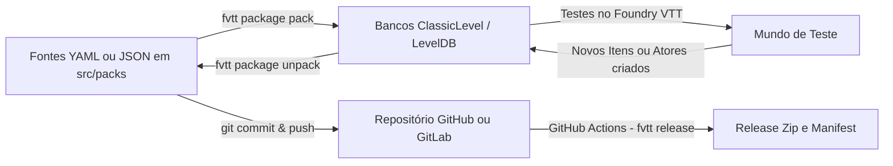

# Ferramentas de Linha de Comando (CLI) para Foundry VTT 💻⚡
> *Guia Oficial de CLI & Automação — Master of Foundry VTT por GM Charles Corrêa*

---

## 📌 Visão Geral

O desenvolvimento profissional de módulos e sistemas para o Foundry Virtual Tabletop, assim como a administração avançada de mundos, se beneficia enormemente do uso de ferramentas de linha de comando (CLI).

As duas ferramentas essenciais são:
1. [**@foundryvtt/foundryvtt-cli (`fvtt`)**](https://github.com/foundryvtt/foundryvtt-cli): CLI Oficial da Foundry Gaming para empacotamento, desempacotamento de compêndios (ClassicLevel / LevelDB / YAML), validação de manifestos e automação de releases.
2. [**fvtt-world-cli**](https://foundryvtt.com/packages/fvtt-world-cli): Utilitário de linha de comando para gerenciamento, clonagem, backup, criação de mundos e automação de testes.

---

## 🛠️ 1. Official Foundry VTT CLI (`@foundryvtt/foundryvtt-cli`)

### Instalação
Pode ser executado diretamente via `npx` ou instalado globalmente:
```bash
# Execução direta sem instalar
npx @foundryvtt/foundryvtt-cli --help

# Ou instalação global
npm install -g @foundryvtt/foundryvtt-cli
```

### Comandos Essenciais

#### A. Configuração Inicial do Ambiente
Configura os caminhos para a pasta de dados (`Data/`) e a instalação do Foundry:
```bash
# Configurar diretório de dados do usuário
fvtt configure set dataPath "C:/Users/<Usuario>/AppData/Local/FoundryVTT/Data"

# Visualizar configurações ativas
fvtt configure get
```

#### B. Gestão de Pacotes & Compêndios (Git-Friendly Workflow)
Um dos maiores desafios no desenvolvimento do Foundry é versionar compêndios binários (`LevelDB`/`ClassicLevel`). O `fvtt package` resolve isso convertendo bancos em arquivos YAML legíveis pelo Git:

```bash
# Definir pacote de trabalho ativo (módulo ou sistema)
fvtt package workon "meu-modulo" --type Module

# Desempacotar compêndios binários para arquivos fontes YAML/JSON (para commit no Git)
fvtt package unpack "meu-modulo"

# Empacotar arquivos fontes YAML/JSON de volta para ClassicLevel (para distribuição/teste)
fvtt package pack "meu-modulo"
```

#### C. Validação de Manifesto & Release
```bash
# Validar manifest (module.json / system.json) contra schemas do Foundry
fvtt package validate "meu-modulo"

# Gerar arquivo zip pronto para release com manifest atualizado
fvtt package release "meu-modulo"
```

---

## 🌍 2. FVTT World CLI (`fvtt-world-cli`)

- **Pacote Oficial:** [https://foundryvtt.com/packages/fvtt-world-cli](https://foundryvtt.com/packages/fvtt-world-cli)
- **Finalidade:** Administração rápida e automação de mundos via terminal, ideal para ambientes de testes automatizados e integração contínua (CI/CD).

### Instalação & Uso
```bash
npx fvtt-world-cli --help
```

### Principais Capacidades:
1. **Criação Rápida de Mundos:** Inicializar mundos com sistemas específicos (`dnd5e`, `pf2e`, `tormenta20`) prontos para testes.
2. **Clonagem e Backup de Mundos:** Duplicar mundos existentes para ambientes de homologação sem risco de corrupção.
3. **Injeção de Pacotes & Compêndios:** Ativar módulos e popular compêndios automaticamente em mundos de desenvolvimento.
4. **Redefinição de Acesso & Senhas:** Resetar senhas de GM e configurações de usuário em mundos bloqueados.

---

## 🔄 Fluxo de Trabalho Recomendado com Git & CI/CD



---

## 🛡️ Protocolo do Agente de IA para Uso de Ferramentas CLI

Quando o desenvolvedor solicitar auxílio com empacotamento de compêndios, releases ou automação:
1. **Verificar Instalação:** O agente deve checar se o Node.js e o `@foundryvtt/foundryvtt-cli` estão disponíveis via `check_env.py` ou `npx`.
2. **Priorizar YAML para Versionamento:** Nunca comitar bancos de dados binários LevelDB diretamente sem desempacotar (`unpack`) para YAML/JSON.
3. **Solicitar Confirmação para Modificações em Massa:** Sempre alertar e solicitar confirmação antes de executar `pack` ou sobrescrever pastas de compêndios locais.
